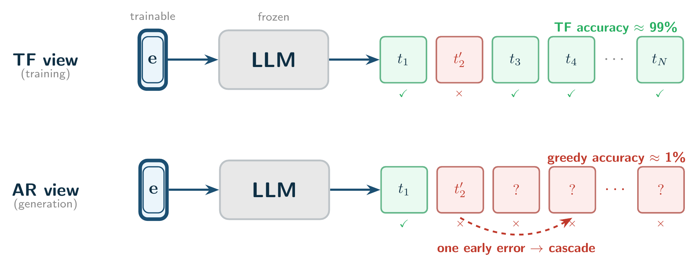
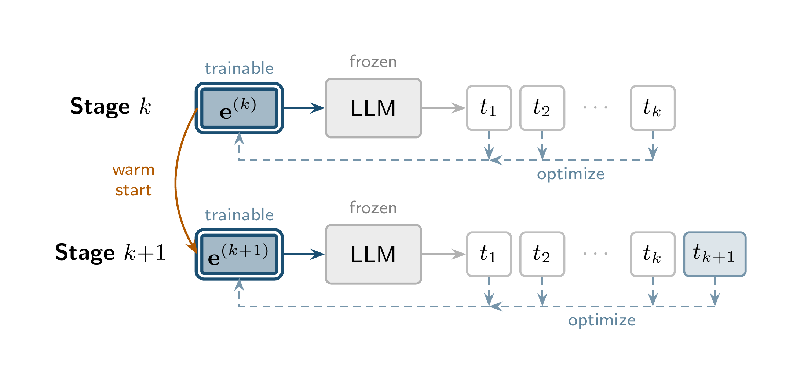
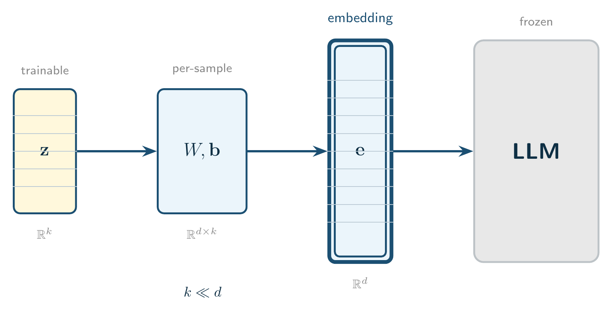
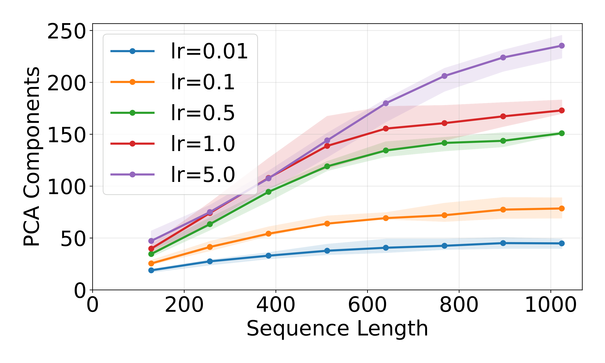
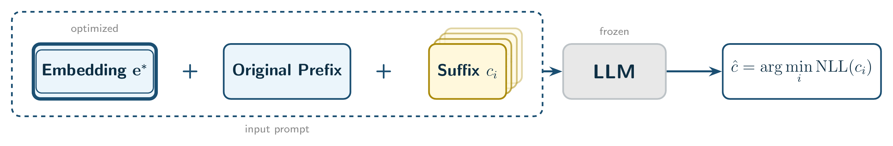
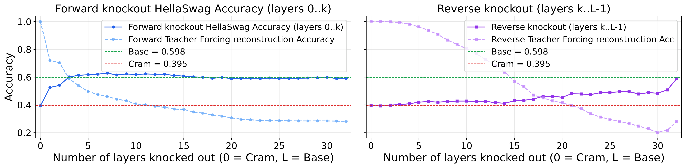
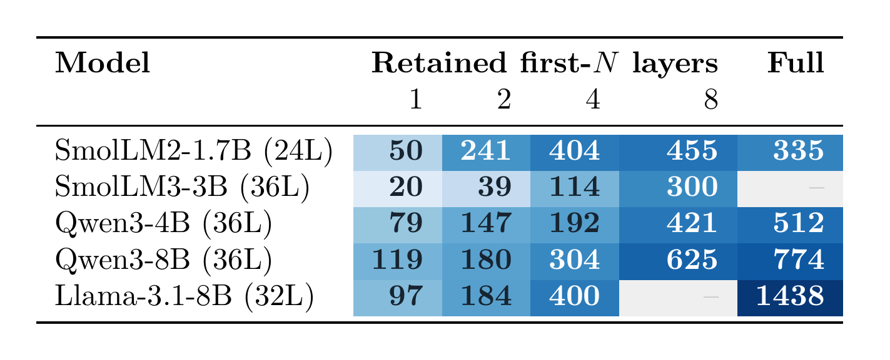

# Как впихнуть больше тысячи токенов в один эмбеддинг — и почему это не понимание, а хитрая манипуляция вниманием

Хабр, привет! Меня зовут Дмитрий Тарасов, я исследователь в лаборатории FusionBrain Lab (AIRI). Нашу с коллегами свежую работу — **«Progressive Cramming: Reliable Token Compression and What It Reveals»** — недавно приняли на **ICML 2026**, и в этой статье я хочу рассказать, что мы  обнаружили.

Начнём с почти магического факта. Год назад в замечательной работе ["Cramming 1568 Tokens into a Single Vector and Back Again"](https://arxiv.org/abs/2502.13063) Юры Куратова а его команды показали, что в **один-единственный входной эмбеддинг** замороженной LLM можно «упаковать» до **1568 токенов** текста так, что модель потом слово в слово его восстанавливает. Полторы тысячи токенов — это несколько абзацев — в одном векторе размерности несколько тысяч. Звучит как невероятная плотность памяти. Кстати, разбор этой статьи уже [был на хабре](https://habr.com/ru/articles/906592/).

У нас этот результат вызвал не только восторг, но и подозрение. Одно дело — *восстановить* текст, и совсем другое — *понимать* его. Что, если «идеальная» реконструкция на самом деле не хранит смысл? В нашей статье мы:

- покажем, что стандартный протокол **token cramming** скрывает катастрофические провалы, и предложим более честную процедуру — **progressive cramming**;
- исследуем траектории оптимизации сжатых последовательностей;
- и, самое интересное, покажем, что идеальная реконструкция **не сохраняет способность модели рассуждать** — а причина этого сидит в **первых слоях** трансформера.

Поехали.

---

## Что не так со стандартным протоколом **token cramming**?

Сначала про задачу. Классический **token cramming** (буквально «впихивание токенов») выглядит так: у нас есть замороженная авторегрессионная модель $\mathcal{M}$ и целевая последовательность токенов $x_1, \dots, x_n$. Мы **градиентным спуском** подбираем один входной эмбеддинг $\mathbf{e}$ так, чтобы модель, получив его на вход, авторегрессионно восстановила весь текст. Веса модели не трогаем — учится только вектор $\mathbf{e}$:

$$\mathbf{e}^* = \arg\min_{\mathbf{e}} \; \Big[-\sum_{i=1}^{n} \log p_{\mathcal{M}}(x_i \mid \mathbf{e},\, x_1, \dots, x_{i-1})\Big].$$

В предыдущей работе фиксировали **бюджет токенов** (например, сжимаем ровно 512, 1024, 1568 токенов) и считали успехом при точности реконструкции 99% токенов. Причём под **teacher forcing**, то есть подавая модели на каждом шаге *правильный* предыдущий токен, а не предсказаные моделью токены, которые могут быть с ошибкой.

И вот здесь кроется ловушка. Мы посмотрели, *где именно* располагается тот самый последний процент ошибок. Оказалось, что ошибки **не распределены равномерно** — они концентрируются в самом начале, на позициях 0 и 1. А для авторегрессионной генерации это фатально: стоит модели ошибиться на первом же токене — и весь дальнейший текст она генерирует, опираясь на неверный префикс. Одна ранняя ошибка **ломает всю цепочку**. Вероятнее всего, ошибка в первых токенах возникает из-за того, что первые токены сложнее сжимать.

Цифры говорят сами за себя. При переходе от teacher forcing к честному **greedy-декодированию** «почти идеальное» сжатие рассыпается:

| Модель | Тип | Токенов | Точность (TF) | Точность (greedy) |
| --- | --- | ---: | ---: | ---: |
| Llama-3.1-8B | Full cramming | 1568 | 99.96% | **40.4%** |
| Llama-3.1-8B | Progressive | 1438 ± 380 | 100% | **100%** |
| Pythia-1.4b | Full cramming | 512 | 99.71% | **44.2%** |
| Pythia-1.4b | Progressive | 430 ± 65 | 100% | **100%** |

99.96% под teacher forcing — и всего 40% при реальной генерации. Разброс ±48% в последней колонке для full cramming означает буквально следующее: часть примеров восстанавливается идеально, а часть — вообще никак, в зависимости от того, повезло ли с первыми токенами.

*Провал full cramming: ранняя ошибка на позиции 0–1 запускает необратимое расхождение при авторегрессионной генерации.*

Вывод: **фиксированный бюджет + порог 99%** — плохая метрика. Она измеряет усреднённую точность, а не то, будет ли текст реально восстановлен. Нам нужна процедура, которая гарантирует настоящую, 100%-ную реконструкцию — и заодно честно говорит, где проходит граница возможностей.

## Метод: Progressive Cramming

Идея простая. Вместо того чтобы сжимать фиксированное количество токенов, мы **наращиваем последовательность по одному токену за раз**:

1. Начинаем с одного токена $x_1$ и обучаем $\mathbf{e}^{(1)}$ до **идеальной** реконструкции.
2. Расширяем последовательность до $(x_1, \dots, x_k)$, инициализируем новый эмбеддинг предыдущим решением ($\mathbf{e}^{(k)} \leftarrow \mathbf{e}^{(k-1)}$) — и дообучаем под более длинный префикс.
3. Повторяем, пока идеальная реконструкция ещё достижима. Останавливаемся, когда уже не можем добавить новый токен без потери качества реконструкции.

Что нам это даёт:

- **Честная граница.** Мы останавливаемся ровно там, где сжатие перестаёт работать, — и получаем точную, посамплово измеренную ёмкость.
- **100% точность реконструкции.** По построению каждый сохранённый эмбеддинг восстанавливает свой префикс идеально.
- **Траектория оптимизации.** Мы сохраняем эмбеддинг $\mathbf{e}^{(k)}$ на каждой стадии — и получаем «след» того, как оптимизатор двигался в пространстве эмбеддингов по мере добавления новых токенов. Это отдельный богатый источник для анализа (о нём ниже).

Но за удобство приходится платить: progressive cramming примерно вдвое медленнее full cramming и плохо батчуется.

### Насколько разные модели умеют сжимать

Мы прогнали progressive cramming на датасете `PG19` и `fanfics` для четырёх семейств моделей. А ещё добавили один приём — **низкоразмерную проекцию** (low-dimensional projection). Вместо того чтобы оптимизировать вектор $\mathbf{e}$ во всей его размерности $d$, мы параметризуем его как $\mathbf{e} = \mathbf{W}\mathbf{z} + \mathbf{b}$, где коэффициенты $\mathbf{z}$ живут в маленьком пространстве размерности $k \ll d$, а $\mathbf{W}, \mathbf{b}$ обучаются для каждого примера. Это меняет геометрию оптимизации и, как оказалось, заметно поднимает ёмкость.

*Low-dim projection: вектор $\mathbf{e} \in \mathbb{R}^d$ параметризуется через коэффициенты $\mathbf{z} \in \mathbb{R}^k$, $k \ll d$.*

Наглядно эффект низкоразмерной проекции виден на анимации: оптимизатор перестаёт «залипать» в одном локальном минимуме и начинает перескакивать в новые локальные минимумы.

*Low-dim projection позволяет оптимизатору исследовать несколько бассейнов решений (при публикации на Хабре — загрузить как видео).*

| Модель | Токенов (base) | Токенов (+low-dim) | Прирост |
| --- | ---: | ---: | ---: |
| Llama-3.1-8B | 1438 | **1697** | 1.2× |
| Pythia-1.4b | 430 | 500 | 1.2× |
| SmolLM2-1.7B | 335 | 957 | **2.9×** |
| Gemma-3-4B | 214 | 697 | **3.3×** |

Прирост неравномерный: у SmolLM2 и Gemma низкоразмерная проекция даёт почти трёхкратный скачок, а вместе с ним растёт и **information gain** (прирост информации — на сколько бит падает суммарная кросс-энтропия текста, если подать модели наш эмбеддинг): у SmolLM2, например, с 1208 до 3271 бит.

## Траектории оптимизации живут в низкой размерности

Помните, я говорил, что progressive cramming даёт нам «след» оптимизатора? Давайте на него посмотрим. Для каждого примера у нас есть последовательность эмбеддингов $\{\mathbf{e}^{(k)}\}$ — по одному на каждый новый сжатый токен. Мы прогнали по этой последовательности **PCA** и задались вопросом: сколько компонент нужно, чтобы объяснить 99% дисперсии этой траектории?

Ответ оказался неожиданно скромным: **30–100 компонент** — и это при том, что сами эмбеддинги живут в пространстве размерности 2048–4096! То есть, хотя оптимизатор блуждает в тысячемерном пространстве, его путь фактически укладывается в тоненькое низкоразмерное подпространство. Причём число компонент растёт с длиной текста логарифмически.

Ещё нагляднее это видно на анимации: спроецируем траекторию на две первые главные компоненты (для примера длиной 1000 токенов у Llama они объясняют 65.7% дисперсии) и покажем заодно «ландшафт точности» — области, где реконструкция почти идеальна.

Точки — оптимизированный эмбеддинг на каждой длине префикса. Цветные области — «бассейны» высокой точности реконструкции. По мере роста текста бассейн **сжимается** — оптимизировать становится всё труднее.

Здесь есть тонкость, которую легко упустить. Низкая размерность — это свойство **пути**, а не множества решений. Мы проверили: если запустить оптимизацию для одного и того же префикса из одной точки, но с разными learning rate, получившиеся (одинаково хорошие!) решения оказываются **в 1.5–1.6 раза дальше друг от друга, чем от старта, и почти ортогональны** (хотя последнее не удивительно для пространства высокой размерности). То есть множество валидных эмбеддингов широкое и высокоразмерное — а low-dim траектория лишь тонкий срез внутри него.

## Реконструкция ≠ понимание

Теперь — к самому важному. Допустим, мы идеально сжали префикс в эмбеддинг. Если этот эмбеддинг честно кодирует смысл текста, то модель, получив его, должна **не хуже решать задачи**, связанные с этим текстом. Проверим?

Мы взяли стандартные бенчмарки с коротким контекстом — **HellaSwag** и **ARC-Easy** — и сравнили два режима:

1. **Base:** обычный префикс на входе.
2. **+Emb:** наш сжатый эмбеддинг *плюс тот же самый префикс* в контексте.

Обратите внимание: во втором режиме оригинальный текст **никуда не девается**, он по-прежнему в контексте. Мы всего лишь *добавляем* спереди сжимающий эмбеддинг. Если он кодирует что-то осмысленное — точность должна как минимум не упасть.

*Протокол оценки: из четырёх вариантов продолжения выбираем тот, у которого наименьшая нормированная negative log-likelihood.*

| Модель | HellaSwag (Base) | HellaSwag (+Emb) | ARC-E (Base) | ARC-E (+Emb) |
| --- | ---: | ---: | ---: | ---: |
| Pythia-1.4b | 44.0% | 37.6% | 53.1% | 49.1% |
| SmolLM2-1.7B | 53.6% | 37.0% | 67.3% | 56.0% |
| Llama-3.1-8B | 61.9% | 40.8% | 63.5% | 43.3% |

Точность **стабильно падает** у всех моделей. Заметно — хотя и остаётся выше случайного угадывания (25% на этих четырёхвариантных задачах). Причём это именно эффект эмбеддинга, а не остаточных ошибок реконструкции: если ограничиться только идеально восстановленными примерами (а их 95–98%), картина не меняется.

Более того: на **5-shot MMLU** (это уже генерация ответа, а не выбор из вариантов по правдоподобию) добавление сжимающего эмбеддинга привеодит к падению точности **практически до нуля**: модель перестаёт выдавать адекватные ответы вообще. При этом **случайный контрольный эмбеддинг** (просто шум) сохраняет точность почти нетронутой. Значит, дело не в том, что мы подали «непонятный токен» — дело именно в **оптимизированном** эмбеддинге, который ломает семантическое понимание моделью сжатого контекста.

Вот он, парадокс: эмбеддинг, который идеально восстанавливает текст, при этом ломает способность модели этим текстом пользоваться. Идеальная реконструкция — это не гарантия сохранения смысла.

## Механизм: причина — в первых слоях

Ок, реконструкция что-то ломает. Но что именно и где? Чтобы установить причину, мы применили **attention knockout**: на выбранных слоях мы маскируем логиты внимания, направленные на компрессионный эмбеддинг, полностью убирая его влияние на этом слое — и смотрим, как это повлияет на качество реконструкции и на метрики бенчмарков. Мы гоняли три протокола на Llama-3.1-8B (32 слоя):

- **Послойный knockout** — глушим компрессионный эмбеддинг на одном слое $l$.
- **Прямой куммулятивный** (forward) — глушим эмбеддинг на слоях с 0-го по $k$-й (от ранних к поздним).
- **Обратный куммулятивный** (reverse) — глушим эмбеддинг на слоях с $k$-го по последний (от поздних к ранним).

<!-- TODO мб добавить картинку послойного KO? -->

*Forward-knockout (глушим ранние слои) быстро восстанавливает downstream-точность до базовой. Reverse-knockout (глушим поздние слои) не помогает, пока не доберётся до ранних слоёв.*

Результат оказался красивым и однозначным:

- **Асимметрия forward/reverse ставит точку.** Forward-knockout (сначала ранние слои) восстанавливает способность рассуждать буквально после первых нескольких слоёв. Обратный (сначала поздние) — почти не помогает, пока не дойдёт до ранних. Это и есть причинное доказательство: **downstream-провал вызывают взаимодействия в ранних слоях**, а высокая масса внимания в поздних слоях — это **симптом**, а не причина.

Мы воспроизвели все три протокола на Pythia-1.4B и SmolLM2-1.7B — картина та же. Получается, сжимающий эмбеддинг «рулит» моделью через ранние слои: эти взаимодействия необходимы для реконструкции, но именно они мешают модели нормально пользоваться контекстом.

## Как ёмкость меняется с изменением архитектуры?

Чтобы получить оценки емкости в зависимости от количества слоев, мы брали первые `N` слоев модели и дообучали на fineweb-edu `X` шагов.
Ёмкость сжатия монотонно растёт и с числом сохранённых слоёв (глубина), и с размером модели (ширина).

Тут видно сразу две закономерности:

- **Глубина.** Внутри одного семейства число идеально сжатых токенов растёт с числом слоёв — примерно **удваиваясь при удвоении глубины** (Qwen3-8B: 119 → 180 → 304 → 625 на 1/2/4/8 слоях).
- **Ширина.** При одинаковой глубине более крупная модель сжимает больше (Qwen3-8B > Qwen3-4B > SmolLM3-3B на каждом $N$).

И эти оси частично взаимозаменяемы. 8-слойный Qwen3-8B (625 токенов) обгоняет **полную** 36-слойную Qwen3-4B (512)! А у SmolLM2 всего 8 первых слоёв (455 токенов) сжимают *больше*, чем полная модель (335) - скорее всего, это связано с дообучением, но это свойство не удалось воспроизвести на других моделях.

## Два бонусных сюжета

### 1. Сложность токена предсказывается его «неожиданностью»

А можно ли предсказать заранее, какой токен будет «дорогим»? Оказалось — да. **Surprisal** токена (его неожиданность, $-\log p$ по базовой модели) хорошо коррелирует с числом шагов, которое progressive cramming тратит на этот токен: корреляция Спирмена **0.44–0.59**. Чем неожиданнее токен для модели — тем дороже будет добавить этот токен к сжатой последовательности.

### 2. Температура кросс-энтропии двигает по фронту «количество vs плотность»

Мы добавили в лосс реконструкции **температуру** $T$: делим логиты на $T$ перед софтмаксом. $T > 1$ «размягчает» распределение, а $T < 1$ — заостряет. Тонкость в том, что критерий сходимости у нас — совпадение по **argmax**, а он инвариантен к любому положительному масштабированию логитов. Значит, температура не может изменить, *какое* решение достижимо в принципе, — она меняет только **путь** оптимизатора к нему. И вот что из этого вышло:

<!-- TODO добавить figure с визуализайий порабол для обоих моделей отдельно для tokens, отдельно для IG -->
| $T$ | Токенов | Information gain (бит) | Длина траектории | PCA 99% |
| ---: | ---: | ---: | ---: | ---: |
| 0.1 | 582 | 966 | 9792 | 85 |
| 0.25 | **670** | 1346 | 9017 | 70 |
| 0.5 | 600 | 1669 | 7595 | 57 |
| 0.75 | 505 | **1771** | 6363 | 49 |
| 1.0  | 421 | 1622 | 5449 | 44 |
| 2.0 | 169 | 714 | 2491 | 30 |

Проступают три чёткие тенденции: **(i)** число сжатых токенов образует перевёрнутую параболу с максимумом при холодном $T{=}0.25$ (у Llama — аналогично, 1574 токена); **(ii)** а вот information gain максимален при более тёплом $T{\approx}0.75$ — то есть «сколько токенов влезло» и «сколько информации несёт эмбеддинг» максимизируются при *разных* температурах; **(iii)** и длина траектории, и её размерность (PCA 99%) **монотонно сжимаются** с ростом $T$.

## Что это всё значит

Соберём выводы вместе:

<!-- TODO -->

- **Идеальная реконструкция — не гарантирует сохранение семантики.**
- **Виноваты ранние слои.**
- **Ёмкость связана с архитектурой модели.**

Что дальше? Мы пока **не знаем**, как сделать эмбеддинг одновременно идеально восстановимым *и* семантически осмысленным — это, пожалуй, центральная нерешённая проблема. Progressive cramming дорог (примерно вдвое медленнее full cramming и плохо батчируется). А результаты с низкоразмерной проекцией намекают, что, возможно, есть алгоритмы оптимизации, которые бы могли найти точку, в которой можно было бы сжать и еще большее количество токенов.

Спасибо, что дочитали!

---

<!-- TODO Благодарности -->
И спасибо большое TODO благодарности

---

**Ссылки:**

- 📄 Статья: *Progressive Cramming: Reliable Token Compression and What It Reveals* (ICML 2026)
- 💻 Код [github.com/FusionBrainLab/progressive_cramming](https://github.com/FusionBrainLab/progressive_cramming)
- 💾 Датасет с траекториями оптимизации [mrsndmn/progressive_cramming_trajectories](https://huggingface.co/datasets/mrsndmn/progressive_cramming_trajectories)
- 👀 [Демо в Colab](https://colab.research.google.com/github/FusionBrainLab/progressive_cramming/blob/main/notebooks/progressive_cramming_demo.ipynb)

